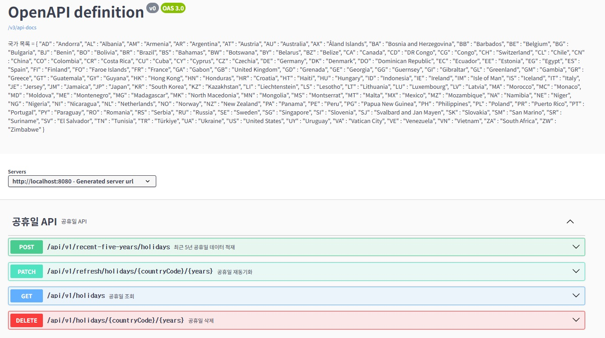
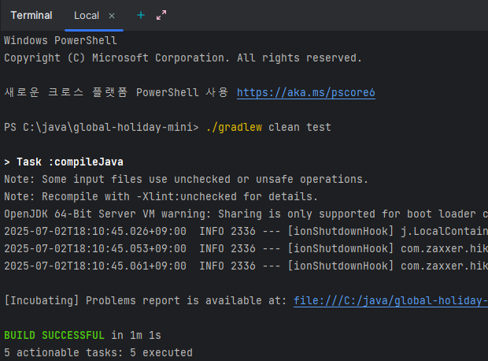
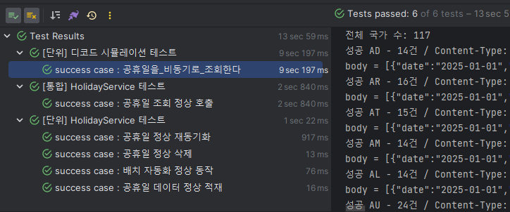

# global-holiday-mini

외부 API로부터 국가별 공휴일 데이터를 수집하여 저장, 조회, 재동기화, 삭제 할 수 있는 REST API 서비스입니다.

<br>

## 빌드 & 실행 방법

```bash
# 1. 프로젝트 클론
git clone https://github.com/rotomoo/global-holiday-mini.git
cd global-holiday-mini

# 2. 빌드
./gradlew clean build

# 3. 실행
./gradlew bootRun
```

<br>

## Swagger UI

[http://localhost:8080/swagger-ui/index.html](http://localhost:8080/swagger-ui/index.html)



<br>

## REST API 명세 요약

### 1. 최근 5년 공휴일 데이터 적재

- **[POST]** `/api/v1/recent-five-years/holidays`
- **설명**: 현재 연도 기준, 최근 5년간의 공휴일 데이터를 외부 API에서 수집해 저장함
- **요청 파라미터**: 없음
- **응답 예시**:

```json
{
  "code": 0,
  "msg": "최근 5년 공휴일 데이터 적재",
  "data": {
    "totalCnt": 8164
  },
  "success": true
}
```

<br>

### 2. 공휴일 조회 (페이징)

- **[GET]** `/api/v1/holidays`
- **설명**: 국가/연도 기준으로 공휴일 목록을 페이징 형태로 조회
- **요청 파라미터 (Query)**:
    - `countryCode` (필수): 국가 코드 (예: KR)
    - `years` (선택): 연도 (예: 2025)
    - `pageNumber` (필수): 페이지 번호 (예: 1)
    - `pageSize` (필수): 페이지 크기 (예: 10)
- **성공 응답 예시**:

```json
{
  "code": 0,
  "msg": "공휴일 조회",
  "data": {
    "paging": {
      "totalCount": 8164,
      "totalPageCount": 817,
      "pageNumber": 1,
      "pageSize": 10
    },
    "list": [
      {
        "id": 8164,
        "date": "2022-06-06",
        "countryCode": "ES",
        "years": 2022,
        "localName": "Lunes de Pascua Granada",
        "name": "Whit Monday",
        "fixed": false,
        "global": false,
        "launchYear": null
      }
    ]
  },
  "success": true
}
```

- **오류 응답 예시 (잘못된 요청)**:

```json
{
  "timestamp": "2025-07-02T09:20:04.512+00:00",
  "status": 500,
  "error": "Internal Server Error",
  "path": "/api/v1/holidays"
}
```

<br>

### 3. 공휴일 재동기화

- **[PATCH]** `/api/v1/refresh/holidays/{countryCode}/{years}`
- **설명**: 특정 국가/연도의 공휴일 데이터를 외부 API에서 재요청 후 기존 데이터를 삭제하고 덮어씀
- **요청 파라미터 (PathVariable)**:
    - `countryCode`: 국가 코드 (예: KR)
    - `years`: 연도 (예: 2025)
- **응답 예시**:

```json
{
  "code": 0,
  "msg": "공휴일 재동기화",
  "data": {
    "totalCnt": 15
  },
  "success": true
}
```

<br>

### 4. 공휴일 삭제

- **[DELETE]** `/api/v1/holidays/{countryCode}/{years}`
- **설명**: 특정 국가, 연도의 공휴일 데이터를 삭제
- **요청 파라미터 (PathVariable)**:
    - `countryCode`: 국가 코드 (예: KR)
    - `years`: 연도 (예: 2025)
- **응답 예시**:

```json
{
  "code": 0,
  "msg": "공휴일 삭제",
  "data": {
    "deleteCnt": 15
  },
  "success": true
}
```

<br>

## 테스트 실행

```bash
./gradlew clean test
```



## 테스트 목록

<br>



## 기술 스택

- Java 21
- Spring Boot 3.4
- WebClient (Spring WebFlux)
- Resilience4j (Retry, CircuitBreaker)
- Swagger
- Gradle
- JUnit5